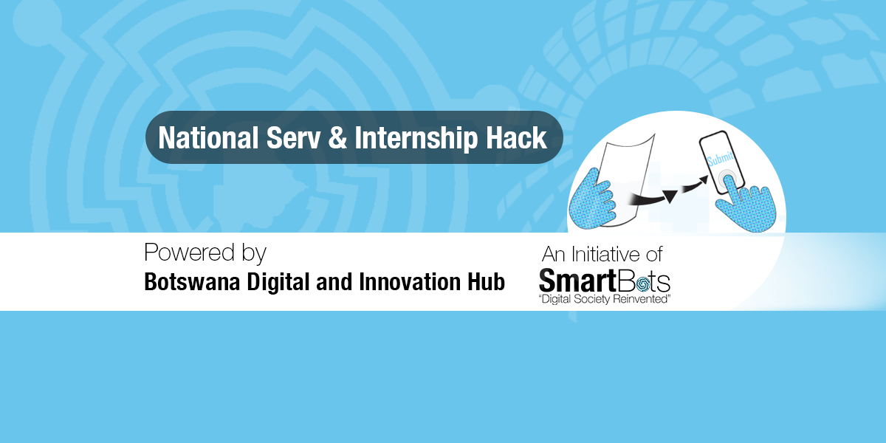
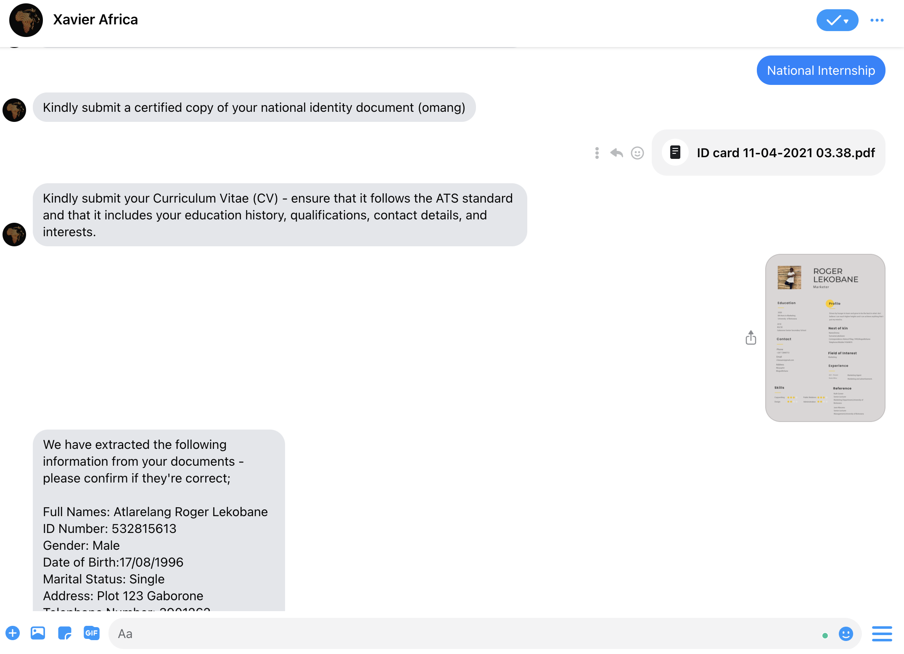

 
  

<h1 align="center">National Service and Internship Hack Submission</h1>
<h3 align="center"> A service that accepts National Service and Internship  applicant's CV and ID documents then uses Computer Vision with NLP cognitive models to extract and carry out the application process on their behalf.The backend service implements Robotic Process Automation to manage application stage processes,notify applicants and programme Information.These enable the service to process information in near real-time thus making it easier to provide high Quality analytics information for program managers,researchers and program strategists</h3>  

 

 
  

<!-- TABLE OF CONTENTS -->
<h2 id="table-of-contents"> :book: Structure</h2>

  
Table of Contents

  <ol>
    <li><a href="#about-the-project"> ➤ About The Project</a></li>
    <li><a href="#stack"> ➤ Stack</a></li>
    <li><a href="#bot"> ➤ Demo 1(Virtual Assistants)</a></li>
    <li><a href="#portal"> ➤ Demo 2(Portal)</a></li>
    <li><a href="#analytics"> ➤ Demo 3 (Analytics)</a></li>
    <li><a href="#doc"> ➤ API/Developer Docummentation</a></li>
    <li><a href="#team"> ➤ Team</a></li>
    
  </ol>

<!-- ABOUT THE PROJECT -->
<h2 id="about-the-project"> :pencil: About The Project</h2>

 
  A service that accepts National Service and Internship  applicant's CV and ID documents then uses Computer Vision with NLP cognitive models to extract and carry out the application process on their behalf.The backend service implements Robotic Process Automation to manage application stage processes,notify applicants and programme Information.These enable the service to process information in near real-time thus making it easier to provide high Quality analytics information for program managers,researchers and program strategists.The idea is to provide a seamless,fast paced,secure and highly scalable service that inter-operates well with other government services.

<!-- PREREQUISITES -->
<h2 id="stack"> :computer: Stack</h2>

<!--This project is written in Python and Javascript  -->
The stack used to build this project:
* Python,Keras,Tensorflow,Elastic(Extract data from unstructured applicant files)
* NodeJs,Dialogflow(Creating Demo virtual assistant)
* NodeJs(Creating application core services-tracking,management,tracking)
* Reactjs(Demo portal)
* Nodejs,Elastic(Analytics endpoints)
* Postman(Testing & creating Developer Docummentation)

<!-- bot -->
<h2 id="bot"> 📋: Virtual Assistant</h2>

 
  Demo of the service through a chatbot integration.
   Watch Bot interaction Demo Video.
  _Please refer to the [Link](https://archive.ics.uci.edu/ml/datasets/WISDM+Smartphone+and+Smartwatch+Activity+and+Biometrics+Dataset+)_ 

  <table>
    <tr>
      <td></td>
      <td></td>
      <td></td>
      <td></td>
    </tr>
 
  </table>

 

<!-- portal -->
<h2 id="portal"> 📋: Portal Demo</h2>
 _portal interaction Video. Please refer to the [Link](https://youtu.be/P6mmCRdlVXo)_ 

 
  Demo of the service through the management web portal

 
 

  <table>
    <tr>
      <td></td>
      <td></td>
    </tr>
 
  </table>

<!-- analytics-->
<h2 id="analytics"> 📋: Analytics Demo</h2>

 
  Analytics Dashboards

 _analytics interaction Video. Please refer to the [Link](https://youtu.be/P6mmCRdlVXo)_ 
 
  

  <table>
    <tr>
      <td></td>
      <td></td>
    </tr>
 
  </table>

 

<!-- analytics-->
<h2 id="doc"> 📋: Developer Documentation </h2>

_Developer Documentation. Please refer to the [Link](https://documenter.getpostman.com/view/12221940/UVC2GTyP)_

 
  Developer Documentation
  

 
  

 
  

 
  

 
 
 <a href="https://docs.google.com/presentation/d/1q1V6qgiDrBObpEXmhjADp2QHiK-3EmuLFjKhTeyLwk0/edit?usp=sharing"> ➤ Design Thinking</a>

 

<!-- analytics-->
<h2 id="team"> 📋: Team-Xavier Africa</h2>

 
<table>
  <tr>
   <td align="center"><a href="https://github.com/identicons/jasonlong.png"> <b>Leloba</b></a> <a href="#eventOrganizing-lolo" title="Project Setup">📋</a> <a href="#example-lolo" title="Code">💻</a></td>
<td align="center"><a href="https://github.com/kesbeast23"> <b>Kesego</b></a> <a href="#eventOrganizing-Kesego23" title="Event Organizing">📋</a> <a href="#example-Kesbeast23" title="Documentation">📖</a> <a href="#example-kesbeast23" title="Code">💻</a></td>
<td align="center"><a href="https://github.com/identicons/jasonlong.png"> <b>Thabang</b></a> <a href="#eventOrganizing-lolo" title="Project Setup">📋</a> <a href="#example-lolo" title="Code">💻</a></td>
<td align="center"><a href="https://github.com/identicons/jasonlong.png"> <b>Duduetsang</b></a> <a href="#eventOrganizing-thabang" title="Project Setup">📋</a> <a href="#example-Dudu" title="Code">💻</a></td>
    <td align="center"><a href="https://github.com/identicons/jasonlong.png"> <b>Withus</b></a> <a href="#eventOrganizing-withus" title="Project Setup">📋</a> <a href="#example-withus" title="Code">💻</a></td>
    <td align="center"><a href="https://github.com/identicons/jasonlong.png"> <b>Letso</b></a> <a href="#eventOrganizing-letso" title="Project Setup">📋</a> <a href="#example-Letso" title="Code">💻</a></td>
  </tr>
</table>

 

<!-- tutorial-->
<h2 id="tut"> :computer: How to get Started </h2>

1. Fork this repository
`https://github.com/Xavier-Botswana/internshiphack.git`
2. Clone your fork down to your local machine
`git clone https://github.com/YOUR-NAME/internshiphack.git`
get into the directory
`cd internshiphack`
3. Create a branch
`git checkout -b branch-name`
preferrably `feature-you-are-working-on`
4. Make your changes (choose from any task given)
5. Add all your changes to be tracked by git 
`git add .`
6. Commit your changes
`git commit -m 'commit message'`
7. Push your changes
`git push origin branch-name`
preferably develop branch
8. Create a new pull request from your forked repository (Click the New Pull Request button located at the top of your repo)
9. Wait for your PR review and merge approval!
10. Star this repository if you had fun!
11. Check your changes by clicking here 

